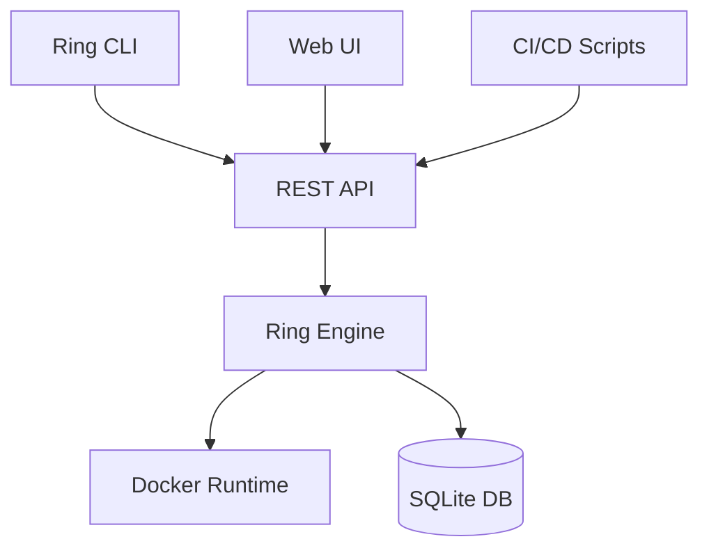

# Getting Started with Ring

This guide will help you get Ring up and running on your system and teach you the fundamentals of container orchestration with Ring.

## Prerequisites

Before starting, make sure you have:

- ✅ **Docker** installed and running
- ✅ **Ring** installed and accessible via command line
- ✅ Basic familiarity with containers and Docker

!!! tip "Not installed yet?"
    If you haven't installed Ring yet, follow our [installation guide](../installation.md).

## System Initialization

### Initialize Ring

The first step is to initialize Ring's database and create the admin user:

```bash
ring init
```

This command will:
- Create the SQLite database (`ring.db` in the current directory)
- Set up the database schema
- Create the default admin user (`admin` / `changeme`)

Expected output:
```
✅ Database initialized successfully
👤 Admin user created (username: admin, password: changeme)
🚀 Ring is ready to use!
```

!!! warning "Security Note"
    Remember to change the default admin password after initialization!

### Start the Ring Server

Now start the Ring orchestration server:

```bash
ring server start
```

The server will:
- Start on port `3030` by default
- Use the SQLite database in the current directory
- Display logs in the console

Expected output:
```
🚀 Ring server starting...
📊 Database loaded: ring.db
🌐 Server listening on http://localhost:3030
✅ Ring server ready!
```

Keep this terminal open as the server needs to run continuously.

## Authentication

### Login to Ring

Open a new terminal and authenticate with Ring:

```bash
ring login --username admin --password changeme
```

Expected output:
```
✅ Authentication successful
🔑 Token saved for future commands
```

### Verify Authentication

Test that everything is working:

```bash
# Check server health
curl http://localhost:3030/healthz

# List deployments (should be empty initially)
ring deployment list
```

## Basic Concepts

Before creating your first deployment, let's understand Ring's key concepts:

### Deployments
A **deployment** describes how to run your application:
- Which container image to use
- How many replicas (instances) to run
- Which namespace to deploy to
- Environment variables and volumes

### Namespaces
**Namespaces** provide logical isolation:
- Each namespace gets its own Docker network
- Applications in different namespaces are isolated
- Common namespaces: `development`, `staging`, `production`

### Workers vs Jobs
Ring supports two types of deployments:
- **Workers**: Long-running services (default)
- **Jobs**: One-time tasks that exit when complete

## Configuration Management

Ring can be configured using:

### YAML Files (Recommended)
```yaml
deployments:
  my-app:
    name: my-app
    runtime: docker
    image: "nginx:latest"
    replicas: 2
    namespace: production
```

### REST API
```bash
curl -X POST http://localhost:3030/deployments \
  -H "Authorization: Bearer $TOKEN" \
  -H "Content-Type: application/json" \
  -d '{"name": "my-app", "image": "nginx:latest"}'
```

## Understanding Ring's Architecture

Ring follows an **API-first design**:



- **Ring CLI**: Command-line interface (what you're using)
- **REST API**: Complete API for all operations
- **Ring Engine**: Core orchestration logic
- **Docker Runtime**: Manages actual containers
- **SQLite Database**: Stores state and configuration

## Your Development Workflow

A typical Ring workflow looks like this:

1. **Describe** your application in a YAML file
2. **Deploy** using `ring apply -f app.yaml`
3. **Monitor** with `ring deployment list`
4. **Update** by modifying the YAML and re-applying
5. **Scale** by changing the `replicas` field
6. **Clean up** with `ring deployment delete`

## Network Isolation

Ring automatically creates isolated networks:

```bash
# Each namespace gets its own network
docker network ls | grep ring

# Example output:
# ring_development    bridge    local
# ring_production     bridge    local
# ring_staging        bridge    local
```

Applications can communicate within the same namespace using container names:
- `http://web-server:80` (within same namespace)
- Cross-namespace communication requires external routing

## Next Steps

Now that Ring is set up and you understand the basics:

1. **Create your first deployment**: Follow the [first deployment guide](first-deployment.md)
2. **Learn deployment management**: Read the [managing deployments guide](managing-deployments.md)
3. **Explore examples**: Check out [practical examples](../examples.md)

## Quick Reference Commands

```bash
# Server management
ring init                    # Initialize Ring
ring server start           # Start Ring server

# Authentication
ring login --username admin --password changeme

# Deployment management
ring apply -f app.yaml      # Deploy application
ring deployment list        # List all deployments
ring deployment inspect <name>  # Get deployment details
ring deployment delete <name>   # Delete deployment

# Monitoring
ring deployment logs <name>     # View logs
ring deployment events <name>   # View events

# User management
ring user list              # List users
ring user create --username <name> --password <pass>
```

## Troubleshooting

### Server won't start
- Check if port 3030 is available: `sudo ss -tlnp | grep 3030`
- Verify Docker is running: `docker ps`
- Check database permissions: `ls -la ring.db`

### Authentication fails
- Verify server is running: `curl http://localhost:3030/healthz`
- Check credentials: default is `admin` / `changeme`
- Re-initialize if needed: `ring init`

### Commands not found
- Verify Ring is installed: `ring --version`
- Check PATH includes Ring binary location

**Ready to deploy your first application?** Continue to the [first deployment guide](first-deployment.md)! 🚀