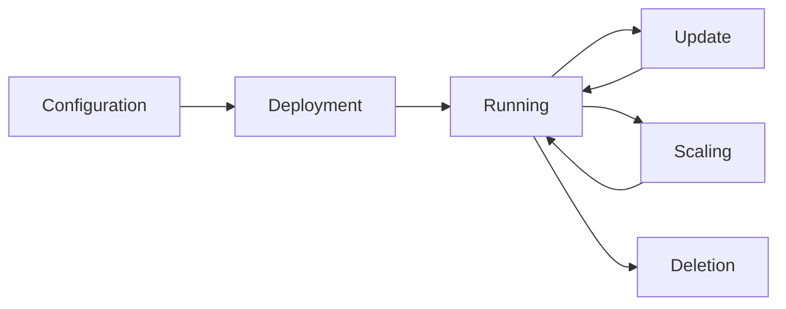

# Managing Deployments

Learn how to efficiently manage your Ring deployments: updating, scaling, monitoring, and troubleshooting.

## Deployment Lifecycle



## Image Version Management

### Updating an Application

Suppose you have this initial configuration:

```yaml title="app.yaml"
deployments:
  web-app:
    name: web-app
    namespace: production
    runtime: docker
    image: "nginx:1.20"
    replicas: 2
```

To update to a new version:

```yaml title="app.yaml"
deployments:
  web-app:
    name: web-app
    namespace: production
    runtime: docker
    image: "nginx:1.21"  # ← New version
    replicas: 2
```

```bash
ring apply -f app.yaml
```

Ring will automatically:
1. Stop the old containers
2. Start new ones with the new image
3. Verify that the new containers are working
4. Maintain the number of replicas

### Image Pull Strategies

```yaml
deployments:
  app:
    # ... other parameters
    config:
      image_pull_policy: "Always"        # Always download the image
      # or
      image_pull_policy: "IfNotPresent"  # Download only if absent
```

**Recommendations:**
- **Production**: `IfNotPresent` with versioned tags
- **Development**: `Always` with tags like `latest`

## Application Scaling

### Horizontal Scaling

```bash
# Method 1: Modify YAML file
# Change replicas: 2 to replicas: 5
ring apply -f app.yaml

# Method 2: REST API
curl -X PUT http://localhost:3030/deployments/web-app \
  -H "Authorization: Bearer $TOKEN" \
  -H "Content-Type: application/json" \
  -d '{"replicas": 5}'
```

### Monitoring Scaling

```bash
# Follow deployment in real-time
ring deployment events web-app --follow

# Check status
ring deployment inspect web-app
```

## Namespace Management

### Organization by Environment

```yaml title="environments.yaml"
deployments:
  # Development environment
  dev-app:
    name: my-app
    namespace: development
    image: "myapp:dev"
    replicas: 1

  # Test environment
  staging-app:
    name: my-app
    namespace: staging
    image: "myapp:staging"
    replicas: 2

  # Production environment
  prod-app:
    name: my-app
    namespace: production
    image: "myapp:v1.2.3"
    replicas: 5
```

### Network Isolation

Namespaces automatically create isolated Docker networks:

```bash
# List Ring networks
docker network ls | grep ring

# Example output:
# ring_development    bridge    local
# ring_staging        bridge    local
# ring_production     bridge    local
```

## Monitoring and Observability

### Application Logs

```bash
# Real-time logs
ring deployment logs web-app --follow

# Logs with timestamps
ring deployment logs web-app --timestamps

# Last 100 lines
ring deployment logs web-app --tail 100
```

### System Events

```bash
# View complete history
ring deployment events web-app

# Filter by event type
ring deployment events web-app --type error

# Follow in real-time
ring deployment events web-app --follow
```

### Basic Metrics

```bash
# Node information
ring node get

# Status of all deployments
ring deployment list --all-namespaces
```

## Advanced Configuration

### Environment Variables and Secrets

```yaml title="app-with-secrets.yaml"
deployments:
  secure-app:
    name: secure-app
    namespace: production
    image: "myapp:latest"
    replicas: 2

    secrets:
      # Static secrets
      DATABASE_HOST: "prod-db.company.com"
      DATABASE_PORT: "5432"

      # Host system environment variables
      DATABASE_PASSWORD: "$DB_PASSWORD"
      API_KEY: "$API_SECRET"

      # Application configuration
      LOG_LEVEL: "info"
      REDIS_URL: "redis://redis.production:6379"
```

### Persistent Volumes

```yaml title="app-with-storage.yaml"
deployments:
  data-app:
    name: data-app
    namespace: production
    image: "postgres:13"
    replicas: 1

    volumes:
      # Persistent storage
      - "/var/lib/ring/postgres:/var/lib/postgresql/data"

      # Configuration
      - "/etc/postgres/custom.conf:/etc/postgresql/postgresql.conf"

      # Logs
      - "/var/log/postgres:/var/log/postgresql"

    secrets:
      POSTGRES_DB: "myapp"
      POSTGRES_USER: "appuser"
      POSTGRES_PASSWORD: "$POSTGRES_PASSWORD"
```

### Private Image Registries

```yaml title="private-registry.yaml"
deployments:
  private-app:
    name: private-app
    namespace: production
    image: "registry.company.com/myapp:v1.0.0"
    replicas: 2

    config:
      username: "registry-user"
      password: "$REGISTRY_PASSWORD"
      image_pull_policy: "Always"
```

## Troubleshooting

### Diagnosing a Failed Deployment

```bash
# 1. Check general status
ring deployment list

# 2. Inspect the problematic deployment
ring deployment inspect problematic-app

# 3. Check logs
ring deployment logs problematic-app --tail 50

# 4. Check events
ring deployment events problematic-app

# 5. Check Docker directly
docker ps --filter "label=ring.deployment=problematic-app"
docker logs container_id
```

### Common Issues

#### Image Not Found
```bash
Error: Failed to pull image 'myapp:latest'
```

**Solutions:**
- Verify the image exists: `docker pull myapp:latest`
- Configure authentication for private registries
- Check network connectivity

#### Insufficient Resources
```bash
Error: Cannot start container: no space left on device
```

**Solutions:**
```bash
# Clean unused images
docker image prune

# Clean stopped containers
docker container prune

# Clean unused volumes
docker volume prune
```

#### Resource Conflicts
```bash
Error: Cannot start container
```

**Solutions:**
- Check for container name conflicts
- Stop conflicting services
- Use different namespaces

## Cleanup and Maintenance

### Namespace Cleanup

```bash
# Remove all deployments from a namespace
ring namespace prune development

# Confirm deletion
ring deployment list --namespace development
```

### Docker Resource Cleanup

```bash
# Clean stopped Ring containers
docker container prune --filter "label=ring_deployment"

# Remove empty Ring networks
docker network prune --filter "name=ring_"
```

## Best Practices

### Using Labels

```yaml
deployments:
  app:
    labels:
      - "app=frontend"
      - "version=v1.2.3"
      - "environment=production"
      - "team=web"
      - "monitoring=prometheus"
```

### Monitoring

```bash
# Simple monitoring script
#!/bin/bash
while true; do
  echo "=== $(date) ==="
  ring deployment list
  ring node get
  sleep 30
done
```

### Automation

```yaml title=".github/workflows/deploy.yml"
name: Deploy to Ring
on:
  push:
    branches: [main]

jobs:
  deploy:
    runs-on: ubuntu-latest
    steps:
      - uses: actions/checkout@v2
      - name: Deploy to Ring
        run: |
          ring login --username ${{ secrets.RING_USER }} --password ${{ secrets.RING_PASSWORD }}
          ring apply -f deployment.yaml
```

## Next Steps

Now that you've mastered deployment management, explore:

- [Practical examples](../examples.md)
- [Command reference](../reference.md)
- [REST API](../api-reference.md)