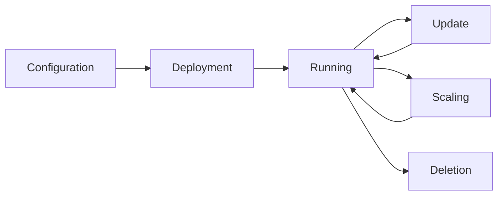

# Managing Deployments

Learn how to efficiently manage your Ring deployments: updating, scaling, monitoring, and troubleshooting.

## Deployment Lifecycle


```mermaid
graph LR
    A[Configuration] --> B[Deployment]
    B --> C[Running]
    C --> D[Update]
    D --> C
    C --> E[Scaling]
    E --> C
    C --> F[Deletion]
```

## Image Version Management

### Updating an Application

Suppose you have this initial configuration:

```yaml title="app.yaml"
deployments:
  web-app:
    name: web-app
    namespace: production
    runtime: docker
    image: "nginx:1.20"
    replicas: 2
```

To update to a new version:

```yaml title="app.yaml"
deployments:
  web-app:
    name: web-app
    namespace: production
    runtime: docker
    image: "nginx:1.21"  # ← New version
    replicas: 2
```

```bash
ring apply -f app.yaml
```

Ring supports two update strategies depending on whether health checks are configured.

### Rolling Update (Zero-Downtime)

When a deployment has **health checks configured**, `ring apply` performs a rolling update automatically. Containers are replaced one by one with no service interruption:

1. A new container with the new image is started
2. Ring waits for it to pass health checks
3. One old container is removed
4. Steps 1-3 repeat until all replicas run the new image

During the rollout, the old deployment stays in `Running` status — traffic continues to be served by the old containers until new ones are confirmed healthy.

```yaml title="app.yaml"
deployments:
  web-app:
    name: web-app
    namespace: production
    runtime: docker
    image: "nginx:1.21"
    replicas: 3

    health_checks:
      - type: http
        url: "http://localhost:80/"
        interval: "10s"
        timeout: "5s"
        threshold: 3
        on_failure: restart
```

```bash
ring apply -f app.yaml
```

You can follow the rollout progress in real-time:

```bash
ring deployment events web-app --follow
```

#### Automatic Rollback on Failure

If a new container fails its health checks, the rollout **stops immediately**. The old containers remain running and unaffected — no manual intervention is needed to keep the service available. The new deployment is marked as `Failed`.

#### Prerequisites

Rolling updates require **all** of the following:

- At least one health check configured on the deployment
- Exactly one active deployment with the same name and namespace
- The `--force` flag is **not** used

If any condition is not met, Ring falls back to immediate replacement.

### Immediate Replacement

Without health checks, or when the `--force` flag is used, Ring performs an immediate replacement:

1. All old containers are stopped
2. New containers are created with the new image
3. The number of replicas is maintained

```bash
# Force immediate replacement even with health checks
ring apply -f app.yaml --force
```

!!! warning "Service Interruption"
    Immediate replacement causes a brief downtime between old containers stopping and new ones becoming ready. Use health checks to enable rolling updates and avoid this.

### Image Pull Strategies

```yaml
deployments:
  app:
    # ... other parameters
    config:
      image_pull_policy: "Always"        # Always download the image
      # or
      image_pull_policy: "IfNotPresent"  # Download only if absent
```

**Recommendations:**
- **Production**: `IfNotPresent` with versioned tags
- **Development**: `Always` with tags like `latest`

## Application Scaling

### Horizontal Scaling

```bash
# Method 1: Modify YAML file
# Change replicas: 2 to replicas: 5
ring apply -f app.yaml

# Method 2: REST API
curl -X PUT http://localhost:3030/deployments/web-app \
  -H "Authorization: Bearer $TOKEN" \
  -H "Content-Type: application/json" \
  -d '{"replicas": 5}'
```

### Monitoring Scaling

```bash
# Follow deployment in real-time
ring deployment events web-app --follow

# Check status
ring deployment inspect web-app
```

## Namespace Management

### Organization by Environment

```yaml title="environments.yaml"
deployments:
  # Development environment
  dev-app:
    name: my-app
    namespace: development
    image: "myapp:dev"
    replicas: 1

  # Test environment
  staging-app:
    name: my-app
    namespace: staging
    image: "myapp:staging"
    replicas: 2

  # Production environment
  prod-app:
    name: my-app
    namespace: production
    image: "myapp:v1.2.3"
    replicas: 5
```

### Network Isolation

Namespaces automatically create isolated Docker networks:

```bash
# List Ring networks
docker network ls | grep ring

# Example output:
# ring_development    bridge    local
# ring_staging        bridge    local
# ring_production     bridge    local
```

## Monitoring and Observability

### Application Logs

```bash
# Real-time logs (SSE streaming)
ring deployment logs web-app --follow

# Last 100 lines
ring deployment logs web-app --tail 100

# Logs from last 10 minutes
ring deployment logs web-app --since 10m

# Filter by container name
ring deployment logs web-app --container web-app-1
```

### System Events

```bash
# View complete history
ring deployment events web-app

# Filter by event type
ring deployment events web-app --type error

# Follow in real-time
ring deployment events web-app --follow
```

### Container Metrics

```bash
# Detailed resource usage for a deployment
ring deployment metrics web-app

# Node-level information
ring node get

# Status of all deployments
ring deployment list --all-namespaces
```

## Advanced Configuration

### Environment Variables and Secrets

```yaml title="app-with-secrets.yaml"
deployments:
  secure-app:
    name: secure-app
    namespace: production
    image: "myapp:latest"
    replicas: 2

    environment:
      # Plain values
      DATABASE_HOST: "prod-db.company.com"
      DATABASE_PORT: "5432"
      LOG_LEVEL: "info"
      REDIS_URL: "redis://redis.production:6379"

      # References to encrypted secrets (managed via ring secret create)
      DATABASE_PASSWORD:
        secretRef: "database-password"
      API_KEY:
        secretRef: "api-key"
```

Ring supports two ways to define environment variables:

- **Plain values**: `KEY: "value"` — passed directly to the container
- **Secret references**: `KEY: { secretRef: "name" }` — references an encrypted secret stored in Ring. The secret must exist in the same namespace as the deployment. It is decrypted and injected at deployment time.

To create the secrets referenced above:

```bash
ring secret create database-password -n production -v "s3cret-p@ss"
ring secret create api-key -n production -v "sk-1234567890"
```

### Persistent Volumes

```yaml title="app-with-storage.yaml"
deployments:
  data-app:
    name: data-app
    namespace: production
    image: "postgres:13"
    replicas: 1

    volumes:
      # Persistent storage
      - "/var/lib/ring/postgres:/var/lib/postgresql/data"

      # Configuration
      - "/etc/postgres/custom.conf:/etc/postgresql/postgresql.conf"

      # Logs
      - "/var/log/postgres:/var/log/postgresql"

    environment:
      POSTGRES_DB: "myapp"
      POSTGRES_USER: "appuser"
      POSTGRES_PASSWORD: "$POSTGRES_PASSWORD"
```

### Private Image Registries

```yaml title="private-registry.yaml"
deployments:
  private-app:
    name: private-app
    namespace: production
    image: "registry.company.com/myapp:v1.0.0"
    replicas: 2

    config:
      username: "registry-user"
      password: "$REGISTRY_PASSWORD"
      image_pull_policy: "Always"
```

## Troubleshooting

### Diagnosing a Failed Deployment

```bash
# 1. Check general status
ring deployment list

# 2. Inspect the problematic deployment
ring deployment inspect problematic-app

# 3. Check logs
ring deployment logs problematic-app --tail 50

# 4. Check events
ring deployment events problematic-app

# 5. Check Docker directly
docker ps --filter "label=ring.deployment=problematic-app"
docker logs container_id
```

### Common Issues

#### Image Not Found
```bash
Error: Failed to pull image 'myapp:latest'
```

**Solutions:**
- Verify the image exists: `docker pull myapp:latest`
- Configure authentication for private registries
- Check network connectivity

#### Insufficient Resources
```bash
Error: Cannot start container: no space left on device
```

**Solutions:**
```bash
# Clean unused images
docker image prune

# Clean stopped containers
docker container prune

# Clean unused volumes
docker volume prune
```

#### Resource Conflicts
```bash
Error: Cannot start container
```

**Solutions:**
- Check for container name conflicts
- Stop conflicting services
- Use different namespaces

## Cleanup and Maintenance

### Namespace Cleanup

```bash
# Remove only stopped/failed deployments (safe default)
ring namespace prune development

# Remove everything, including running deployments
ring namespace prune development --all

# Confirm deletion
ring deployment list --namespace development
```

### Docker Resource Cleanup

```bash
# Clean stopped Ring containers
docker container prune --filter "label=ring_deployment"

# Remove empty Ring networks
docker network prune --filter "name=ring_"
```

## Best Practices

### Using Labels

```yaml
deployments:
  app:
    labels:
      - "app=frontend"
      - "version=v1.2.3"
      - "environment=production"
      - "team=web"
      - "monitoring=prometheus"
```

### Monitoring

```bash
# Simple monitoring script
#!/bin/bash
while true; do
  echo "=== $(date) ==="
  ring deployment list
  ring node get
  sleep 30
done
```

### Automation

```yaml title=".github/workflows/deploy.yml"
name: Deploy to Ring
on:
  push:
    branches: [main]

jobs:
  deploy:
    runs-on: ubuntu-latest
    steps:
      - uses: actions/checkout@v2
      - name: Deploy to Ring
        env:
          RING_TOKEN: ${{ secrets.RING_TOKEN }}
        run: |
          ring apply -f deployment.yaml
```

## Next Steps

Now that you've mastered deployment management, explore:

- [Practical examples](../examples.md)
- [Command reference](../reference.md)
- [REST API](../api-reference.md)